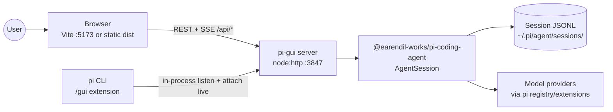
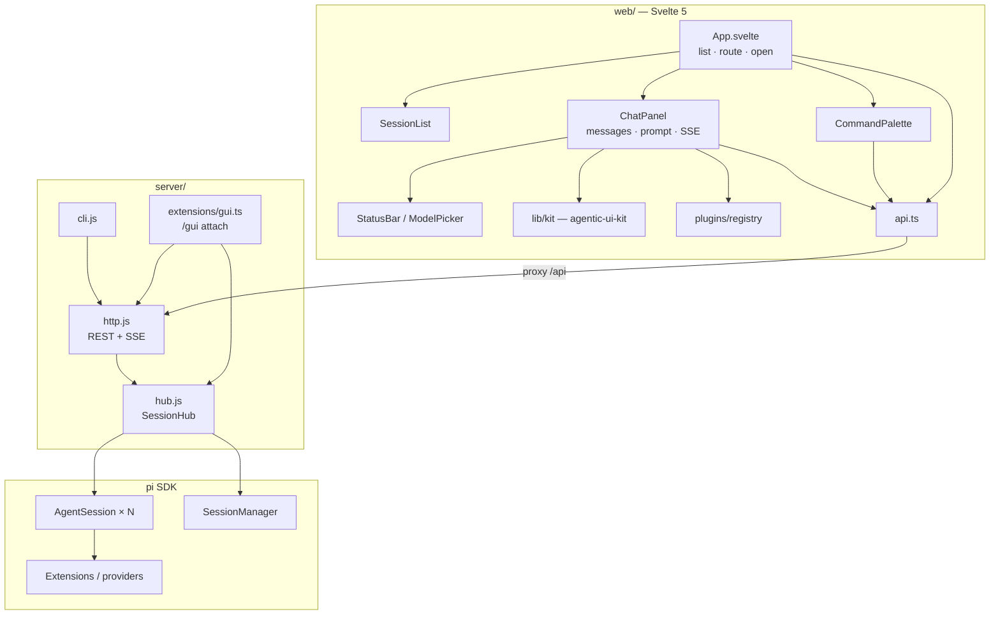
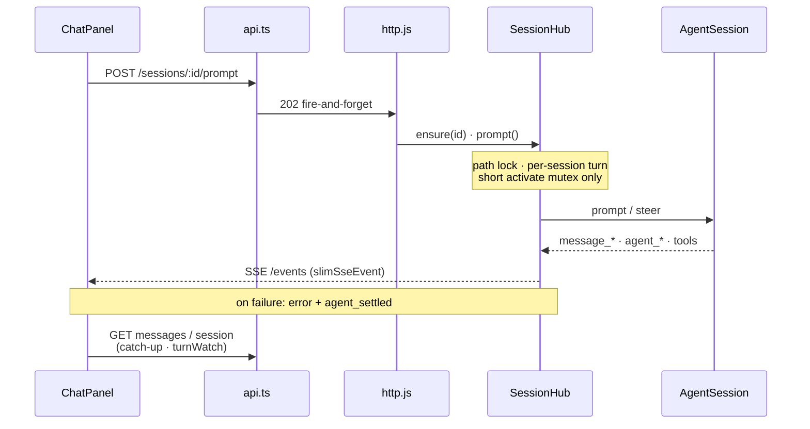
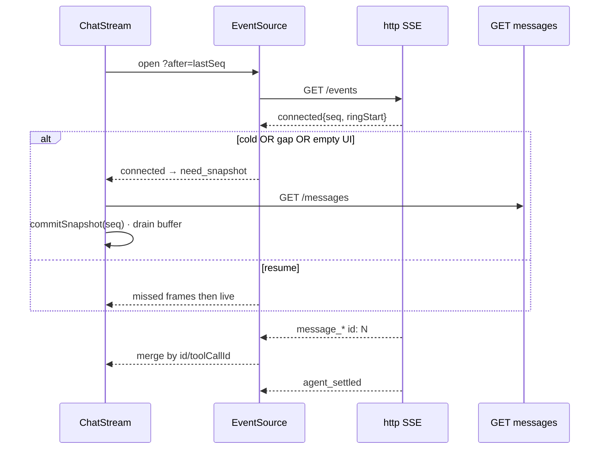

# Architecture

Localhost web UI over pi’s coding-agent SDK. Thin client + multi-session hub; no Express/socket.io.

## System context



## Component view



## One turn



## SessionHub

| Concern | Approach |
|---------|----------|
| Identity | Prefer **hub id** after open; `ensure` reopens by disk id/path |
| Multi-session | Many open; **per-session** turn queues; activate mutex only for `session_start` |
| Live TUI attach | `/gui` indexes `AgentSession` (extension patch) → `hub.attach` / `detach` |
| Transport | REST for commands; **SSE** for stream; no WebSocket |
| Client truth | `ChatStream`: seq gate + snapshot barrier + id merge |
| SSE resume | Cold/gap → REST snapshot; hot → ring `seq > after` + live |
| Idle | `PI_GUI_SESSION_IDLE_MS` closes sessions with no SSE clients (`0` = off) |
| Process entry | `pi-gui` / `cli.js` (standalone), or pi **`/gui`** (in-process + live attach) |

## Chat stream pipeline (contract)



**Merge rules:** optimistic user → replaced on server `message_start`; assistant slot while streaming; `toolResult` by `toolCallId`. Never “last same role”.

## Deploy shapes

```text
dev:   Vite :5173  ──proxy /api──►  node server :3847
prod:  same process serves dist/ + API on PI_GUI_PORT (default 3847)
pi:    pi install <pi-gui>  →  /gui opens browser against hub
```

## Trust boundary

```text
127.0.0.1 only · no auth · CORS * OK on localhost
UI is a dumb shell; agent power lives in the SDK process
```

## Related

- [boundaries.md](./boundaries.md) — edit zones
- [reference/api.md](./reference/api.md) — routes
- [reference/events.md](./reference/events.md) — SSE / client merge
